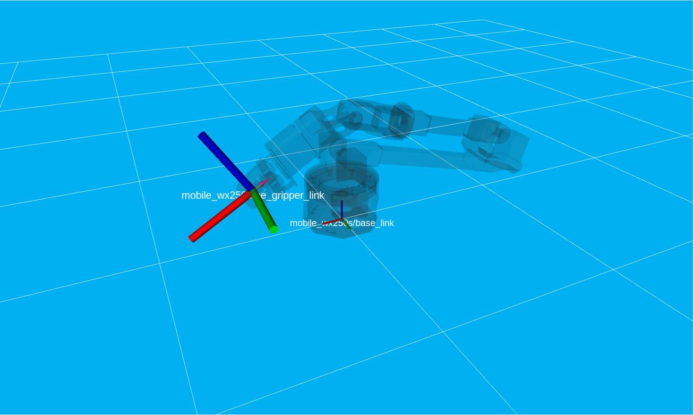
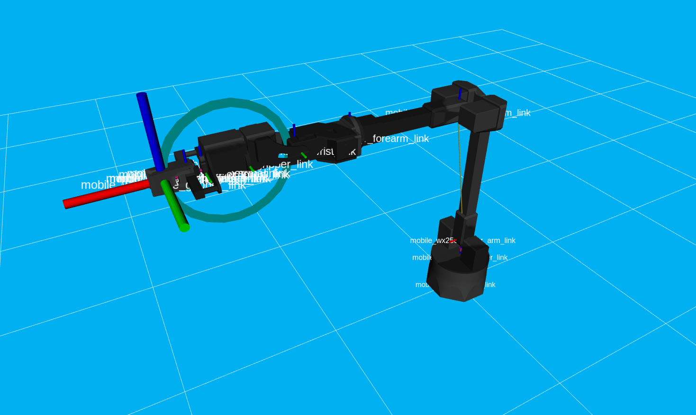
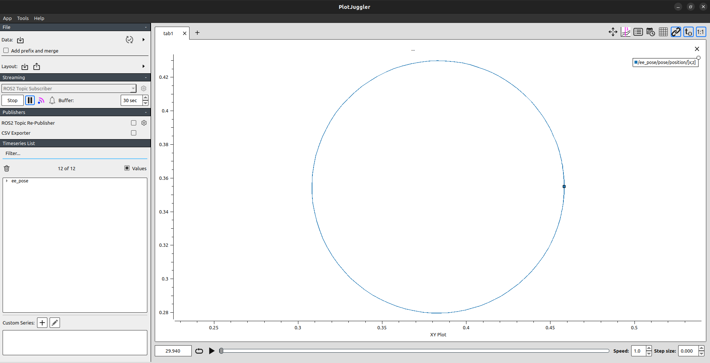

## Prerequisites

First you need to have followed all [the steps](https://docs.trossenrobotics.com/interbotix_xsarms_docs/ros_interface/ros2/software_setup.html#amd64-architecture) for having the `interbotix_ws` in your machine.

You need also to have Plotjuggler installed:
```
sudo snap install plotjuggler
sudo apt install ros-$ROS_DISTRO-plotjuggler-ros
```
Follow this [guide](https://github.com/facontidavide/PlotJuggler/tree/main) for more info.


## Setup 

```
cd ~/interbotix_ws/src/interbotix_ros_manipulators/interbotix_ros_xsarms
git clone git@github.com:P3dr1x/traj_tracking_py.git
cd ~/interbotix_ws
colcon build --packages-select traj_tracking_py --symlink-install
```

This will have the `traj_tracking_py` package operative on your pc.

## Launching the control

The launch file will start the control of the arm with the `ros2_control` controller [JointTrajectoryController](https://control.ros.org/humble/doc/ros2_controllers/joint_trajectory_controller/doc/userdoc.html).

This also launches a [publisher](https://github.com/P3dr1x/traj_tracking_py/blob/main/traj_tracking_py/ee_pose_publisher.py) that publishes the transformation between the `base_link` frame and the end-effector frame (`ee_gripper_link` frame). 

<div align="center">
  
</div>

The position of the end-effector is plotted in Plotjuggler (check here for a quick [guide](https://youtu.be/9kFRecDU1bg?si=nHbMTthe3SLJ_b6p) on Plotjuggler). 

### Connecting to real hardware (Mobile WidowX250S)

```
ros2 launch traj_tracking_py tracking.launch.py robot_model:=mobile_wx250s 
```

After having launched this file RViz and Plotjuggler should start. Plotjuggler may ask you if you want to start the previously used plugins. Say yes. Then select the `/ee_pose` topic as topic to plot.

### Connecting to simulated hardware (only RViz visualization)

```
ros2 launch traj_tracking_py tracking.launch.py robot_model:=mobile_wx250s hardware_type:=fake
```

## Trajectory tracking with WidowX250S arm

In this package there is an action client that makes a call to the action server `mobile_wx250s/arm_controller/follow_joint_trajectory` that activates when the arm_controller is launched

### Example of usage

For executing with the EE the circular trajectory that is contained in the `\trajectories` folder, open another terminal and

```
cd interbotix_ws
. install/setup.bash
ros2 run traj_tracking_py traj_tracker_client ~/interbotix_ws/src/interbotix_ros_manipulators/interbotix_ros_xsarms/traj_tracking_py/trajectories/q_traj_circle.csv
```

 Trajectory Tracked | PlotJuggler |
|-------------------|-------------|
|  |  |
